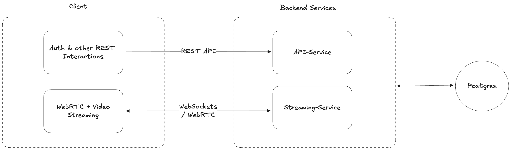
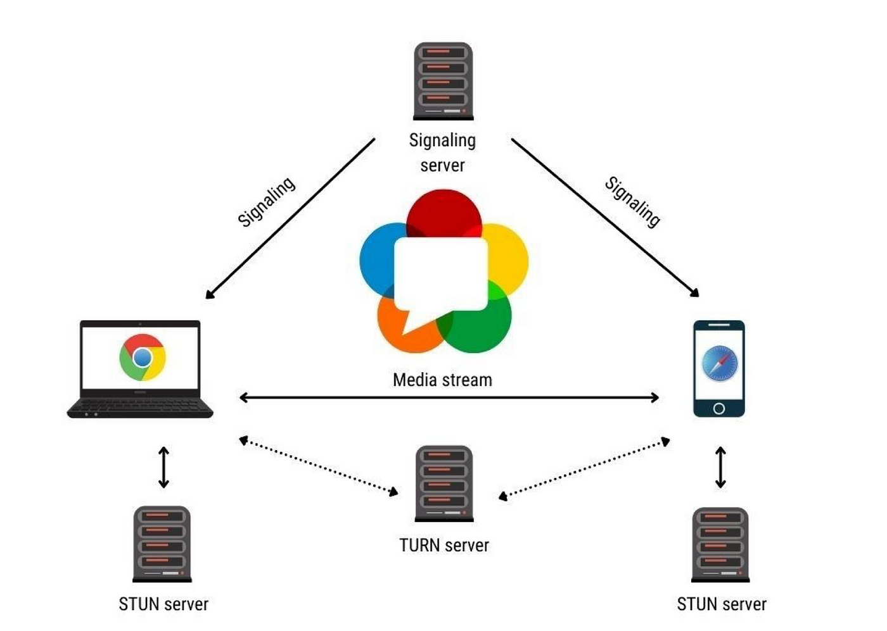

# The Swamp

A real‑time video‑chat web app built with React on the frontend and Go on the backend. Users can create “Swamps” (rooms), associate each Swamp with a topic, join live video calls (WebRTC) and chat (WebSockets), and manage their topic preferences via a profile page.

---

##  Features

- **Live Video & Chat**  
  - Peer‑to‑peer WebRTC streaming with STUN/TURN support  
  - WebSocket‑based group chat in every Swamp room

- **Topics & Swamp Association**  
  - Create and manage Topics via REST API  
  - Each Swamp picks exactly one Topic at creation  
  - Swamp list and details show the assigned topic name

- **User Profiles & Preferences**  
  - Users select their favorite topics in Profile  
  - Personalized topic‑filtered views (future enhancement)

- **Authentication**  
  - Email/password login with OTP signup flow  
  - JWT tokens managed in frontend Redux store

---

##  Tech Stack

- **Backend**: Go (Fiber + Chi), GORM, PostgreSQL, Pion WebRTC  
- **Frontend**: React, Redux Toolkit, React Router, Tailwind CSS, shadcn/ui  
- **Real‑time**: WebSocket (Fiber), WebRTC (Pion)  
- **Testing**: Cypress (frontend), Go’s `httptest` & `testify` (backend)


## Microservices Setup



- Developed a Fiber-based Go microservice (`Streaming-Service`) responsible for:
  - Handling WebSocket signaling connections
  - Managing WebRTC session negotiation (SDP and ICE exchange)
  - Maintaining peer connection sessions and lifecycle events

## WebRTC and WebSocket Integration

- Implemented signaling over WebSockets to support:
  - Room creation and joining
  - Exchange of SDP offers and answers
  - Exchange of ICE candidates for peer connectivity
- Integrated signaling flow into the frontend, enabling:
  - Real-time WebSocket communication
  - Dynamic peer connections

## Video and Audio Streaming

- Integrated WebRTC media capabilities to support:
  - Live video and audio streaming between clients
  - Browser-based media capture (camera and microphone)
  - Viewer join flow using WebRTC and WebSocket negotiation
- Configured support for TURN and STUN servers to enable NAT traversal and fallback routing



---

##  Prerequisites

- **Go** 1.20+  
- **PostgreSQL** 12+  
- **Node.js** 16+ & npm or yarn  
- (Optional) `make` or your favorite task runner

---

## Setup & Run

### Backend

1. Clone & install dependencies  
   ```bash
   git clone https://github.com/your-org/the‑swamp.git
   cd the‑swamp/backend
   go mod tidy
   ```

2. Configure your Postgres DSN in database/db.go
  
3. Run migrations & start the server 
  ```bash
  go run main.go
  ```

### Frontend

1. Install dependencies and start
 ```bash
cd the‑swamp/frontend
npm install     # or yarn
npm run dev     # or yarn dev
```

2. Open your browser at http://localhost:5173

