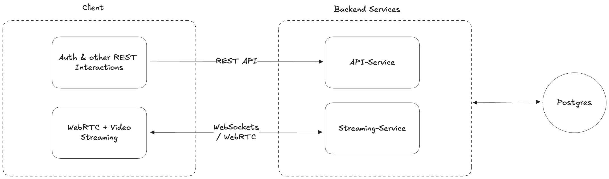
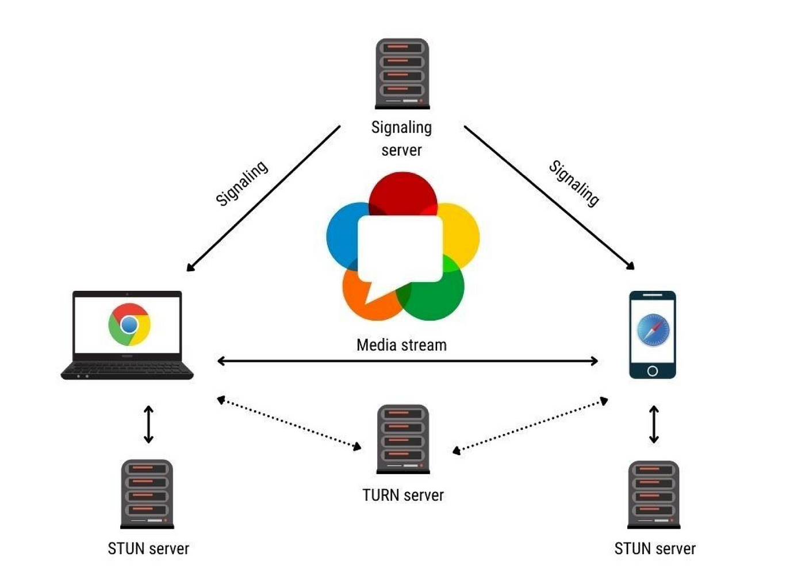

# WebRTC & WebSocket Integration - Sprint Update

## Sprint Highlights

This sprint focused on implementing the real-time streaming infrastructure using WebSockets and WebRTC.

## Microservices Setup

- Developed a Fiber-based Go microservice (`Streaming-Service`) responsible for:
  - Handling WebSocket signaling connections
  - Managing WebRTC session negotiation (SDP and ICE exchange)
  - Maintaining peer connection sessions and lifecycle events

## WebRTC and WebSocket Integration

- Implemented signaling over WebSockets to support:
  - Room creation and joining
  - Exchange of SDP offers and answers
  - Exchange of ICE candidates for peer connectivity
- Integrated signaling flow into the frontend, enabling:
  - Real-time WebSocket communication
  - Dynamic peer connections

## Video and Audio Streaming

- Integrated WebRTC media capabilities to support:
  - Live video and audio streaming between clients
  - Browser-based media capture (camera and microphone)
  - Viewer join flow using WebRTC and WebSocket negotiation
- Configured support for TURN and STUN servers to enable NAT traversal and fallback routing

